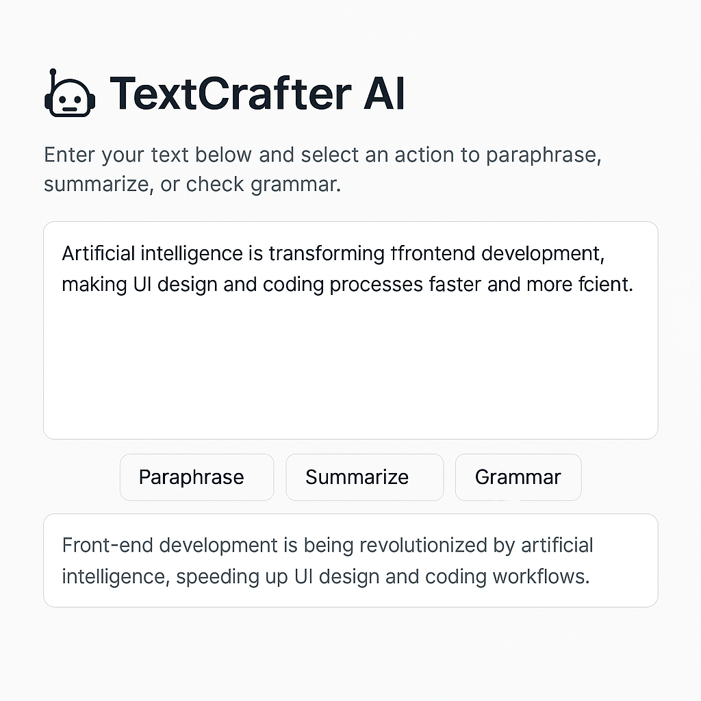

# TextCrafter AI ✍️🤖

A lightweight React app that uses AI to summarize, paraphrase, and grammar-check your text in seconds.



## ✨ Features

- ✏️ **Paraphrasing** — Rewrite your text for clarity or variation
- 📚 **Summarization** — Automatically reduce long text to key points
- 🧹 **Grammar Correction** — Fix typos and polish your writing
- ⚡ **Real-time AI API** integration (HuggingFace or OpenAI)
- 🎨 Built with **React + TailwindCSS**

---

## 🚀 Live Demo

🌐 [Click here to try it live](https://your-vercel-link.com)

---

## 🛠️ Tech Stack

- React
- TailwindCSS
- HuggingFace Inference API (or OpenAI)
- Vercel / Netlify (for deployment)

---

## 📦 Installation

```bash
git clone https://github.com/yourusername/textcrafter-ai.git
cd textcrafter-ai
npm install
npm run dev
```

> You’ll need an API key from HuggingFace or OpenAI (see below).

---

## 🔑 Setup API Key

Create a `.env` file in the root directory and add:

```env
VITE_AI_API_KEY=your_api_key_here
```

If you're using HuggingFace:
```env
VITE_AI_API_URL=https://api-inference.huggingface.co/models/<model-name>
```

---

## 📁 Project Structure

```
src/
│
├── components/
│   └── TextForm.jsx     # main UI + form logic
├── App.jsx              # main app structure
├── index.js             # entry point
├── styles/
│   └── tailwind.config.js
```

---

## 📄 License

MIT — feel free to use, modify, or contribute!

---

## 🤝 Contributing

Pull requests are welcome. For major changes, please open an issue first.

---

## 🙋‍♀️ About Me

I'm a student passionate about AI and frontend development.  
This project is part of my learning and contribution to the open-source community.  
If you like it, give it a ⭐ and check out my other work!

- 📧 [Your email]
- 🌐 [Your LinkedIn or Portfolio]
- 💻 GitHub: [yourusername]
